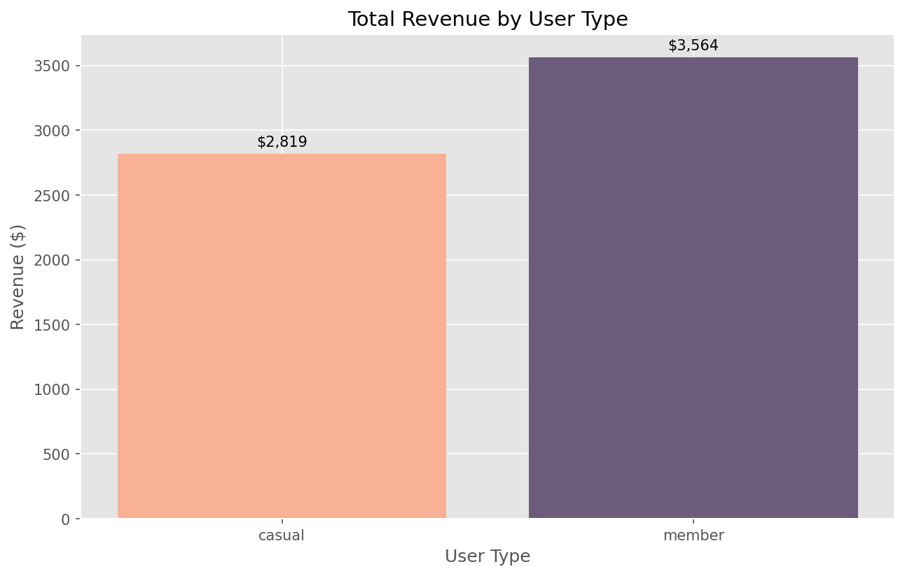
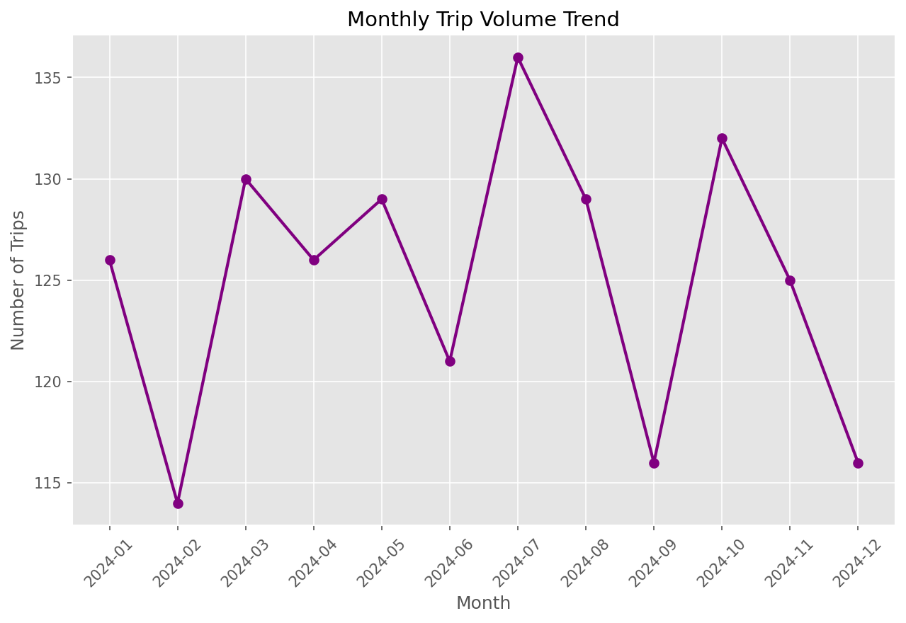
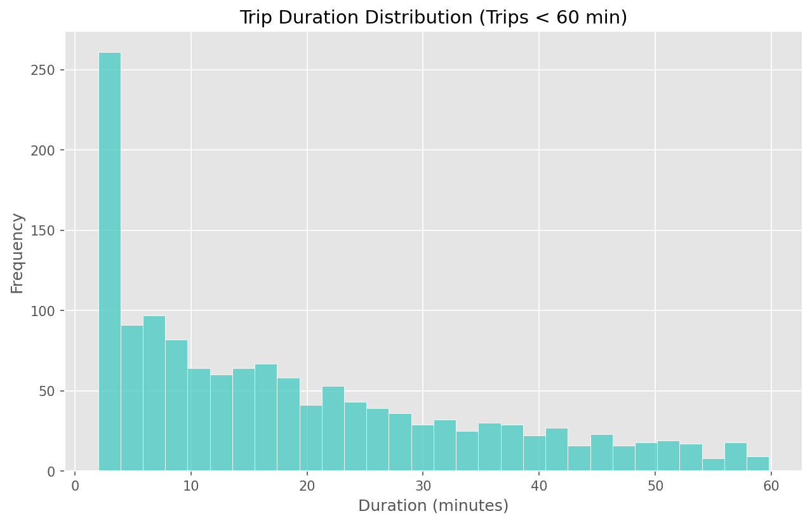
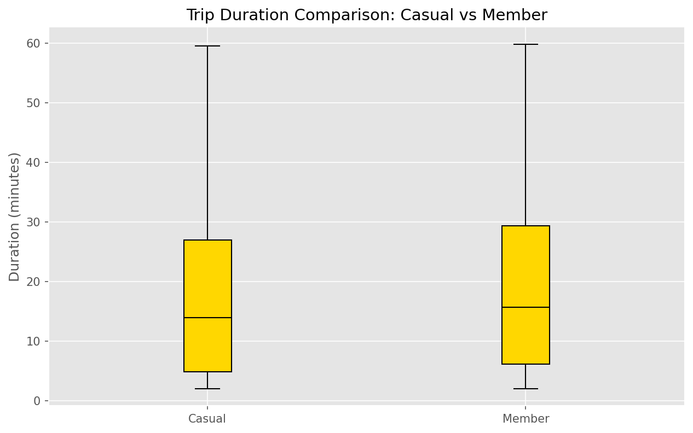

# CityBike Analytics

**Author:** Tetiana Pasicnyk

**Project Type:** Educational project for practicing Python OOP, algorithms, and data analysis. Analytical platform for a bike-sharing system to simulate, process, and analyze trip data.

## Project Goal

The goal of this project is to simulate and analyze a bike-sharing system
using Python. The project demonstrates:

- Object-Oriented Programming
- Custom algorithms (sorting, searching)
- NumPy vectorized calculations
- Business analytics
- Automated reporting
- Visualizations

## Installation

1. Create a virtual environment:
```bash
python -m venv venv
```
2. Activate the environment:
```bash
# macOS/Linux
source venv/bin/activate
# Windows
venv\Scripts\activate
```
3. Install required packages:
```bash
pip install -r requirements.txt
```
4. Generate synthetic data:
```bash
python3 data_gen.py
```

## Running the Project
```bash
python main.py
```

## Dependencies
* `pandas` — for working with tables and data
* `numpy` — numerical computations
* `matplotlib` — plotting and visualization
* Other packages listed in `requirements.txt`

## Project Structure
```
citybike/
├── main.py
├── models.py
├── analyzer.py
├── algorithms.py
├── numerical.py
├── visualization.py
├── pricing.py
├── factories.py
├── utils.py
├── data/
└── output/
```

## Algorithms & Big-O Analysis

In Milestone 4, custom sorting and searching algorithms were implemented to process trip data.

### Sorting

| Algorithm              | Time Complexity (Average) | Space Complexity | Notes                                     |
| :--------------------- | :------------------------ | :--------------- | :---------------------------------------- |
| **Merge Sort**         | O(n log n)                | O(n)             | Stable, efficient for large datasets      |
| **Insertion Sort**     | O(n²)                     | O(n)*            | Efficient for small or nearly sorted data |
| **Built-in (Timsort)** | O(n log n)                | O(n)             | Hybrid algorithm, highly optimized in C   |

*Note: Space complexity for Insertion Sort is O(n) in this implementation because a copy of the list is created.*

### Searching

| Algorithm           | Time Complexity | Space Complexity | Pre-condition          |
| :------------------ | :-------------- | :--------------- | :--------------------- |
| **Linear Search**   | O(n)            | O(1)             | None                   |
| **Binary Search**   | O(log n)        | O(1)             | Data must be sorted    |
| **Built-in (`in`)** | O(n)            | O(1)             | Average case for lists |

### Benchmark Results

Based on testing, built-in `sorted()` and `in` operators are significantly faster due to low-level C optimizations. Binary Search outperformed Linear Search on large, sorted datasets.

**Notes:**

* Custom algorithms are implemented and ready for benchmarking.
* Built-in Python functions remain faster due to low-level optimizations.
* Binary search is significantly faster than linear search on large, sorted datasets.

## Analysis Results (Sample)

### Overall Summary
- Total trips: 1500  
- Total distance: 11,502 km  
- ARPU: $98.19  

### Peak Usage
- Busiest hour: 18:00  
- Busiest day: Tuesday  

### Top Stations
1. Old Town (113 trips)  
2. Riverside Park (110)  
3. Market Square (110)  

### Top Routes
- Lakeside → Tech Hub (14 trips)
- Harbor View → Harbor View (13 trips)

### Financial & Maintenance
- Electric bikes: $13,988 total maintenance
- Classic bikes: $5,496 total maintenance

### Anomalies
- BK325, BK283 → highest number of outlier trips

## Visualizations

### 1. Revenue by User Type


### 2. Monthly Trip Volume Trend


### 3. Trip Duration Distribution


### 4. Trip Duration Comparison by User Type

